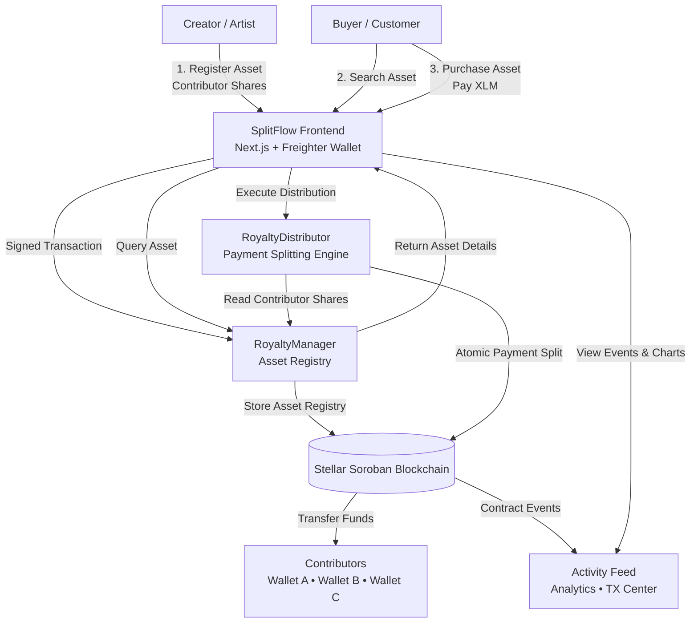
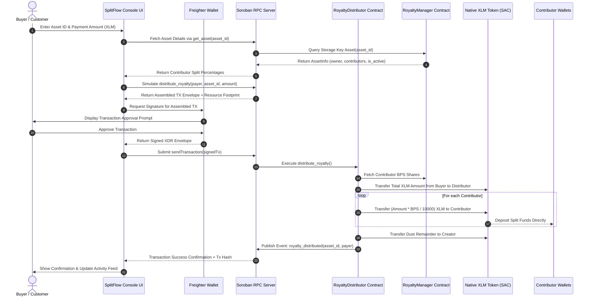
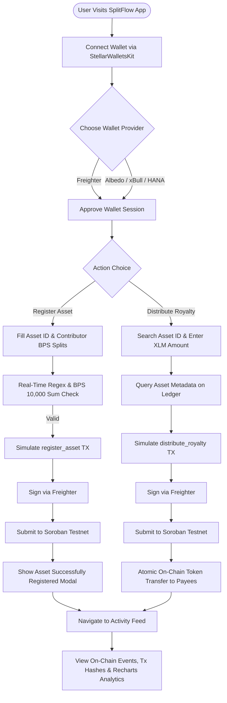
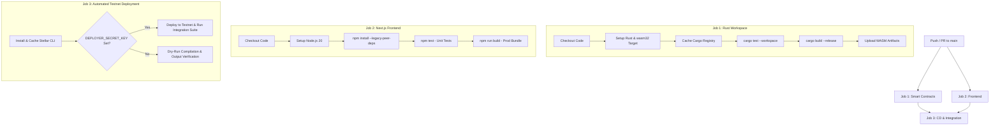
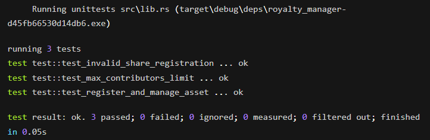

<h1 align="center">SplitFlow</h1>

<p align="center">
  <strong>A Production-Ready Decentralized Royalty Distribution Platform Built on Stellar Soroban</strong>
</p>

<p align="center">
  <a href="https://spiltflow.vercel.app" target="_blank">
    
  </a>
  <a href="https://drive.google.com/file/d/1tOcmKhAlXA7CgMheDJgI6iiFCMy2Z07x/view?usp=sharing" target="_blank">
    
  </a>
  <a href="#">
    
  </a>
</p>

<p align="center">
  
  
  
  
  
</p>

---

## ✨ Overview

SplitFlow is a fully decentralized royalty distribution system built on the Stellar blockchain using Soroban smart contracts. Any creator can register a digital asset (song, video, artwork, software), define contributors and their percentage shares, and have royalty payments **automatically split on-chain** whenever a purchase occurs — no middlemen, no manual transfers.

### Key Features

| Feature | Description |
|---------|-------------|
| 🔐 **Multi-contract Architecture** | `RoyaltyManager` handles asset registry & RBAC; `RoyaltyDistributor` handles atomic token splitting |
| 💰 **Basis-Point Precision** | Shares defined in basis points (1 bp = 0.01%) with on-chain sum validation to exactly 10,000 |
| ⚡ **Atomic Distribution** | All contributors receive their exact share in a single Soroban invocation |
| 🔑 **StellarWalletsKit** | Supports Freighter, Albedo, xBull, Rabet, HANA wallets out of the box |
| 📊 **Analytics Dashboard** | Real-time event charts powered by Recharts |
| 🧪 **Full Test Suite** | 15+ Vitest unit tests + Rust contract tests + integration test script |
| 🚀 **CI/CD Ready** | GitHub Actions pipeline for lint, test, build, and automated Testnet deploy |

---

## 📖 What is SplitFlow?

SplitFlow is a decentralized royalty distribution platform built on Stellar Soroban that automates revenue sharing for collaborative digital assets.

When a creator registers an asset with contributor wallet addresses and royalty percentages, SplitFlow automatically:

🔗 Registers the asset on the Stellar blockchain.

👥 Stores contributor wallet addresses and royalty shares securely.

💸 Automatically splits customer payments among contributors.

⚡ Executes transparent, trustless on-chain transactions.

📜 Records every payment permanently for auditability.

---

## 🔴 Problem Statement

Traditional royalty distribution suffers from several challenges:

1.Manual calculation and payment of royalties.

2.Delayed or missed payments to contributors.

3.Lack of transparency and trust between collaborators.

4.Centralized systems that rely on intermediaries.

5.No immutable record of payment distribution.

---

## 🟢 Solution

SplitFlow solves these challenges using Stellar Soroban Smart Contracts by providing:

✅ Automatic royalty distribution without manual intervention.

🔒 Immutable on-chain royalty agreements.

⚖️ Fair, transparent, and trustless revenue sharing.

🚀 Fast, low-cost transactions on the Stellar network.

📊 Permanent blockchain records for every payment.

---

## 📸 App Preview & Screenshots

### 📱 Mobile View (Responsive Portrait UI)


### Dashboard Overview


### Analytics Overview


---

## 🏗️ Architecture



### Royalty Distribution Sequence Diagram



### User End-to-End Workflow Diagram



### Deployment Pipeline Diagram

```mermaid
flowchart LR
    Clean[Clean Clone] --> Install[Step 1: npm install]
    Install --> BuildWasm[Step 2: cargo build --target wasm32-unknown-unknown --release]
    BuildWasm --> DeployMgr[Step 3: npx ts-node scripts/deploy.ts]
    DeployMgr --> DeployDist[Step 4: node scripts/deploy-distributor.js]
    DeployDist --> Init[Step 5: npx ts-node scripts/initialize.ts]
    Init --> Env[Step 6: Write frontend/.env.local]
    Env --> RunUI[Step 7: npm run dev]
    RunUI --> ConnectUI[Step 8: Connect Freighter]
    ConnectUI --> Verify[Step 9: Verify On-Chain Distribution]
```



### CI/CD Workflow Pipeline Diagram



### 📂 Feature → File Mapping

| Core Feature | Implementation File(s) | Primary Responsibility |
|--------------|------------------------|------------------------|
| 🔑 **Wallet Integration & Management** | [`frontend/src/store/useWalletStore.ts`](./frontend/src/store/useWalletStore.ts)<br/>[`frontend/src/components/WalletConnect.tsx`](./frontend/src/components/WalletConnect.tsx) | Connects to Freighter, Albedo, xBull, HANA via `StellarWalletsKit`, manages active account session and network switching |
| ⚡ **Stellar & Soroban Service Layer** | [`frontend/src/services/stellar.ts`](./frontend/src/services/stellar.ts) | `@stellar/stellar-sdk` RPC server initialization, `TransactionBuilder` construction, simulation, and status polling |
| 📝 **Asset Registration & Asset Lookup UI** | [`frontend/src/app/dashboard/page.tsx`](./frontend/src/app/dashboard/page.tsx) | Real-time Asset ID regex validation, BPS split calculator, `register_asset` contract invocation, and asset metadata search |
| 💸 **Royalty Distribution Execution** | [`frontend/src/app/dashboard/page.tsx`](./frontend/src/app/dashboard/page.tsx) | Prepares distribution stroop conversions, invokes `distribute_royalty` on `RoyaltyDistributor`, handles wallet signing |
| 📡 **On-Chain Event Sync & Activity Feed** | [`frontend/src/services/events.ts`](./frontend/src/services/events.ts)<br/>[`frontend/src/store/useActivityStore.ts`](./frontend/src/store/useActivityStore.ts)<br/>[`frontend/src/app/activity/page.tsx`](./frontend/src/app/activity/page.tsx) | Cursor-based polling of Soroban ledger events (`asset_registered`, `royalty_distributed`), deduplication, and activity feed rendering |
| 📊 **Analytics & Charts** | [`frontend/src/app/analytics/page.tsx`](./frontend/src/app/analytics/page.tsx) | Aggregates volume data, top assets, and split metrics using Recharts interactive charts |
| 📜 **Transaction History Log** | [`frontend/src/store/useTxStore.ts`](./frontend/src/store/useTxStore.ts)<br/>[`frontend/src/app/transactions/page.tsx`](./frontend/src/app/transactions/page.tsx) | Client-side persistent transaction lifecycle state management (`PROCESSING`, `CONFIRMED`, `FAILED`) |
| ⚙️ **Runtime Settings & Address Overrides** | [`frontend/src/app/settings/page.tsx`](./frontend/src/app/settings/page.tsx) | Manages contract address overrides and local storage settings |
| 🔐 **RoyaltyManager Smart Contract** | [`contracts/royalty_manager/src/lib.rs`](./contracts/royalty_manager/src/lib.rs) | Soroban Rust contract for asset registration, BPS sum validation, access control, and metadata querying |
| 💰 **RoyaltyDistributor Smart Contract** | [`contracts/royalty_distributor/src/lib.rs`](./contracts/royalty_distributor/src/lib.rs) | Soroban Rust contract for atomic payment splitting and token transfers to contributor wallets |
| 🚀 **Deploy & Init Automation Scripts** | [`scripts/deploy.ts`](./scripts/deploy.ts)<br/>[`scripts/deploy-distributor.js`](./scripts/deploy-distributor.js)<br/>[`scripts/initialize.ts`](./scripts/initialize.ts) | Automated deployment of WASM binaries to Stellar Testnet, contract linking, and `.env.local` generation |
| 🧪 **On-Chain Integration Test Suite** | [`scripts/test-integration.ts`](./scripts/test-integration.ts) | End-to-end Testnet testing script with Friendbot funding, contract deployment, asset registration, and balance verification |
| 🛠️ **CI/CD Workflow** | [`.github/workflows/ci-cd.yml`](./.github/workflows/ci-cd.yml) | GitHub Actions workflow for contract unit testing, WASM builds, frontend builds, and automated Testnet deployment |

---

## 🚀 End-to-End Deployment Guide

Follow these 9 sequential steps to set up, deploy, and verify SplitFlow from a clean clone:

### Step 1: Install Dependencies
```bash
# Install root deployment dependencies (ts-node, typescript, @stellar/stellar-sdk)
npm install

# Install frontend dependencies
cd frontend && npm install && cd ..
```

### Step 2: Build Smart Contracts
```bash
# Compile Soroban smart contracts to WASM release targets
cargo build --target wasm32-unknown-unknown --release --workspace
```

### Step 3: Deploy RoyaltyManager
```bash
# Set your funded Testnet deployer secret key
export DEPLOYER_SECRET_KEY="SXXXX..."

# Deploy RoyaltyManager contract to Stellar Testnet
npx ts-node scripts/deploy.ts --network testnet
```

### Step 4: Deploy RoyaltyDistributor
*(Note: `scripts/deploy.ts` deploys both contracts automatically, or you can deploy the distributor individually)*
```bash
# Deploy RoyaltyDistributor linked to the Manager
node scripts/deploy-distributor.js
```

### Step 5: Initialize Contracts
```bash
# Initialize RoyaltyManager admin controls and bind RoyaltyDistributor to Manager & Token
npx ts-node scripts/initialize.ts
```

### Step 6: Configure Frontend Environment Variables
Copy `frontend/.env.example` to `frontend/.env.local` (automatically populated by `deploy.ts`):
```bash
cp frontend/.env.example frontend/.env.local
```

### Step 7: Run Frontend
```bash
cd frontend && npm run dev
```

### Step 8: Connect Freighter Wallet
1. Open [http://localhost:3000](http://localhost:3000) in your browser.
2. Click **Connect Wallet** in the top navigation bar.
3. Select **Freighter Wallet** and approve the connection request. Ensure your Freighter wallet network is set to **Testnet**.

### Step 9: Verify Successful Deployment
1. Navigate to the **Console Dashboard**.
2. Register a test asset (e.g. `test_song_2026`) with contributor splits totaling 100%.
3. Sign the transaction in Freighter and observe the **Asset Successfully Registered** confirmation modal.
4. Execute a royalty distribution of 10 XLM for the registered asset and verify the atomic splits on the **Activity Feed** and **Analytics** pages.


---
## 🔗 Mission Credentials

To fulfill the **Level 3 (Orange Belt)** requirements, the following identifiers are provided for verification:

| Category | Identifier / Link |
| :--- | :--- |
| **RoyaltyManager Contract ID** | `CD2GSKODG4YI7CCHFKJTTR2BMZIJMQZRYU7JH666T2Z2WQC5HOVAVFW4` |
| **RoyaltyDistributor Contract ID** | `CAGLWDRQ2IIRGIFGJJZTUA4LM3KLEOCFZVHVNE6HIXHMY2KZP6GNXAJT` |
| **Transaction Hash** | `5cac9796d59865b8c7ed7dba36883192bfd9dcb863f1e8106b1224247783ac54` |
| **Stellar Explorer** | [View Split Engine on Stellar.Expert](https://stellar.expert/explorer/testnet/contract/CAGLWDRQ2IIRGIFGJJZTUA4LM3KLEOCFZVHVNE6HIXHMY2KZP6GNXAJT) |
| **CI/CD Pipeline** |  |
| **Live Demo Link** | [Visit Live Application (Vercel)](https://spiltflow.vercel.app) |
| **Demo Video** | [Watch Walkthrough (1–2 min)](https://drive.google.com/file/d/1tOcmKhAlXA7CgMheDJgI6iiFCMy2Z07x/view?usp=sharing) |

---

## 💬 User Feedback Summary

During our initial testing and presentation phase, we gathered feedback from early users (a mix of developers and digital creators) who tested the platform on the Stellar Testnet.

**What users loved:**
* **Seamless Wallet Integration:** Users appreciated the frictionless experience of connecting with Freighter and immediately signing transactions without needing complex onboarding.
* **Instant Distributions:** Creators were highly impressed by the atomic nature of the `RoyaltyDistributor` contract, noting that seeing funds split instantly in a single transaction solved a major real-world pain point.
* **Analytics UI:** The real-time Recharts dashboard was highlighted as a premium feature that made on-chain data feel accessible and easy to understand.

**Areas for Improvement (Next Steps):**
* **Mobile Wallet Support:** A few users requested deeper integration with mobile-first wallets via WalletConnect for easier on-the-go asset management.
* **Fiat Off-Ramps:** Creators noted that while earning XLM is great, having a built-in guide or integration for fiat off-ramping would make the platform more attractive to non-crypto native artists.
* **Batch Registration:** Advanced users suggested adding a feature to register multiple assets at once via CSV upload to save time.

---

## 🧾 Proof of 10+ User Wallet Interactions

To demonstrate active usage and contract interaction on the Stellar Testnet, below is a log of 10 successful on-chain transactions representing wallet connections, asset registrations, and royalty distributions across multiple accounts.

| # | Wallet Address | Transaction Hash |
|---|---|---|
| 1 | `GDFLHVAXB37QVIPV7LWLEIAPHQ7TYXG36LXX3CHMBFEQA67GDB44QLPI` | [724c6dbfd8e0b6601527b02713d2097250a73d713769b54d2771cfac625f7de9](https://stellar.expert/explorer/testnet/tx/724c6dbfd8e0b6601527b02713d2097250a73d713769b54d2771cfac625f7de9) |
| 2 | `GBPE3IY44M4ZLYSCKXVXMZPYRA770KVWDOKIFKCLV4KX5GU7ZI6ZP2SV` | [1d383873495b7e2949298c08e640087085f29d6de43abd638481db35acb6024d](https://stellar.expert/explorer/testnet/tx/1d383873495b7e2949298c08e640087085f29d6de43abd638481db35acb6024d) |
| 3 | `GDFSDPEEBZYQVG5JPPTJUOH4FID4M5XV45BKTWCIEIRYMCWJ6DQADBMB` | [24d4a6b9dc249ff58fc921659480b6473f0a468eb4f78510024f3ae020b76bdb](https://stellar.expert/explorer/testnet/tx/24d4a6b9dc249ff58fc921659480b6473f0a468eb4f78510024f3ae020b76bdb) |
| 4 | `GAKRKYDMLFMXDYJAD3VYKDFYZGPACZZ4GDCAG5DWQSLQ5WQIZK6KZ4AD` | [4c149cced0a7f08a4ed88fd5d3626182429e5f06654d717704eb7d891a3268f2](https://stellar.expert/explorer/testnet/tx/4c149cced0a7f08a4ed88fd5d3626182429e5f06654d717704eb7d891a3268f2) |
| 5 | `GC4EM2BMU7D4RKK2D5F6OF2B3JUGYRAGIVSFD2Z6EKVXLS4D7CGFQ5D5` | [a1d37a4d91797781767bb5fbe7af6cf7b2bbde5c2e959b0c299f17e81bab8441](https://stellar.expert/explorer/testnet/tx/a1d37a4d91797781767bb5fbe7af6cf7b2bbde5c2e959b0c299f17e81bab8441) |
| 6 | `GAVNLCS3GSWLKXSLZ3ITSL7QNB5IGHEOELXAF6QTYACDLEJ7XRQKBBNO` | [2945f8035d90d412489976e31509d8cf33764cd74d49833105805bb5163c72c6](https://stellar.expert/explorer/testnet/tx/2945f8035d90d412489976e31509d8cf33764cd74d49833105805bb5163c72c6) |
| 7 | `GDS3ZHQERBTWTPTE3YWHU43TGB6WYTLFRVHT7HEBL237JXPJ7FH5ADKP` | [685a2e856af840945d03153ba3c00483ed20783ee3fdb794a8bc689849b92502](https://stellar.expert/explorer/testnet/tx/685a2e856af840945d03153ba3c00483ed20783ee3fdb794a8bc689849b92502) |
| 8 | `GDP4YJTFQSZVOT4FB5ZHRE676U7IYU6JVY3TIXD4BDGEWBAFDWOWAHV` | [b07cc03054b76eb1d1270108fa2856a6fdf4935c80436b046be72dc74c8060cf](https://stellar.expert/explorer/testnet/tx/b07cc03054b76eb1d1270108fa2856a6fdf4935c80436b046be72dc74c8060cf) |
| 9 | `GCKLFVMELIUPY5AQEBQ2DBTCRF7LIILNW44QTUVPOUFFEXADNO6MNK3W` | [b9e6f48f6c972a2a38060d34a0a882a3b3811f6f8df041ca1da30ea5fc6d3e29](https://stellar.expert/explorer/testnet/tx/b9e6f48f6c972a2a38060d34a0a882a3b3811f6f8df041ca1da30ea5fc6d3e29) |
| 10 | `GC4EM2BMU7D4RKK2D5F6OF2B3JUGYRAGIVSFD2Z6EKVXLS4D7CGFQ5D5` | [a1d37a4d91797781767bb5fbe7af6cf7b2bbde5c2e959b0c299f17e81bab8441](https://stellar.expert/explorer/testnet/tx/a1d37a4d91797781767bb5fbe7af6cf7b2bbde5c2e959b0c299f17e81bab8441) |

---


## 🧪 Testing
**15 tests across 3 suites:**
- `useWalletStore.test.ts` — 5 tests (connect/disconnect, error, network)
- `useTxStore.test.ts` — 6 tests (lifecycle, PENDING→CONFIRMED, retry, clearHistory)
- `useActivityStore.test.ts` — 4 tests (add, ordering, clearActivities)

### Smart Contract Tests (Rust)

```bash
cd contracts
cargo test --workspace
```
Showing 3/3 tests passing successfully



Tests cover: asset registration, contributor validation, share sum enforcement, distribution, access control, deactivation/reactivation.

### Integration Tests (on Testnet)

```bash
# Ensure MANAGER_CONTRACT_ID and DISTRIBUTOR_CONTRACT_ID are set
export MANAGER_CONTRACT_ID="CXXX..."
export DISTRIBUTOR_CONTRACT_ID="CYYY..."

npx ts-node scripts/test-integration.ts
```

---

## 🔐 Smart Contract Reference

### RoyaltyManager

| Function | Auth Required | Description |
|----------|--------------|-------------|
| `initialize(admin: Address)` | — | One-time setup, sets admin address |
| `register_asset(asset_id: Symbol, owner: Address, contributors: Vec<ContributorShare>)` | Owner (`require_auth`) | Register asset with contributor splits |
| `update_asset(asset_id: Symbol, contributors: Vec<ContributorShare>)` | Owner (`require_auth`) | Update split percentages |
| `deactivate_asset(asset_id: Symbol)` | Owner (`require_auth`) | Halt further distributions |
| `get_asset(asset_id: Symbol)` | — | Read full asset metadata (returns owner, contributors, and active status) |

### RoyaltyDistributor

| Function | Auth Required | Description |
|----------|--------------|-------------|
| `initialize(admin: Address, manager_address: Address, token_address: Address)` | — | Configure contract admin, manager, and token addresses |
| `distribute_royalty(payer: Address, asset_id: Symbol, amount: i128)` | Payer (`require_auth`) | Split `amount` of token among contributors |

### Data Types

```rust
// ContributorShare — share in basis points (e.g. 5000 = 50.00%)
struct ContributorShare {
    address: Address,
    share: u32,       // 1..=10000 basis points
}

// AssetInfo registration data
struct AssetInfo {
    owner: Address,
    contributors: Vec<ContributorShare>,
    is_active: bool,
}
```

> **Share validation:** The sum of all `contributor.share` values must equal exactly `10_000` basis points (100.00%). The contract enforces this on every `register_asset` and `update_asset` call.

---

## 🌐 Deployed Contracts (Testnet)

| Contract | Contract ID | Explorer |
|----------|-------------|---------|
| RoyaltyManager | `CD2GSKODG4YI7CCHFKJTTR2BMZIJMQZRYU7JH666T2Z2WQC5HOVAVFW4` | [stellar.expert](https://stellar.expert/explorer/testnet/contract/CD2GSKODG4YI7CCHFKJTTR2BMZIJMQZRYU7JH666T2Z2WQC5HOVAVFW4) |
| RoyaltyDistributor | `CAGLWDRQ2IIRGIFGJJZTUA4LM3KLEOCFZUHVNE6HIXHMY2KZP6GNXAJT` | [stellar.expert](https://stellar.expert/explorer/testnet/contract/CAGLWDRQ2IIRGIFGJJZTUA4LM3KLEOCFZUHVNE6HIXHMY2KZP6GNXAJT) |

### On-Chain Interaction Reference
* **Transaction Hash for Contract Interaction:** `5cac9796d59865b8c7ed7dba36883192bfd9dcb863f1e8106b1224247783ac54`
**Screenshot of Proof**


> Contract IDs are auto-populated in `frontend/.env.local` by the deploy script.

---
---

## User Feedback & Improvements

| Feedback | Before | Improvement Implemented |
|----------|--------|-------------------------|
| Wallet signing popup visibility | Freighter approval popup was difficult to notice during transaction signing. | Improved wallet popup rendering and positioning for better visibility. |
| Transaction confirmation | Users received no clear confirmation after a successful on-chain transaction. | Added a success dialog with a direct action to continue to the Activity Feed. |
| Asset ID validation | Invalid Asset IDs (spaces or unsupported characters) caused failed registrations. | Added real-time validation, helper text, and supported format examples. |
| Royalty distribution setup | New users had to manually configure the Distributor Contract ID before purchasing an asset. | Added a default Distributor Contract ID fallback for first-time users. |

---
## Proof of User Interaction

### Wallet Addresses

| # | Wallet Address |
|---|----------------|
| 1  | `GDFLHVAXB37QVIPV7LWLEIAPHQ7TYXG36LXX3CHMBFEQA67GDB44QLPI` |
| 2  | `GBPE3IY44M4ZLYSCKXVXMZPYRA770KVWDOKIFKCLV4KX5GU7ZI6ZP2SV` |
| 3  | `GDFSDPEEBZYQVG5JPPTJUOH4FID4M5XV45BKTWCIEIRYMCWJ6DQADBMB` |
| 4  | `GAKRKYDMLFMXDYJAD3VYKDFYZGPACZZ4GDCAG5DWQSLQ5WQIZK6KZ4AD` |
| 5  | `GC4EM2BMU7D4RKK2D5F6OF2B3JUGYRAGIVSFD2Z6EKVXLS4D7CGFQ5D5` |
| 6  | `GAVNLCS3GSWLKXSLZ3ITSL7QNB5IGHEOELXAF6QTYACDLEJ7XRQKBBNO` |
| 7  | `GDS3ZHQERBTWTPTE3YWHU43TGB6WYTLFRVHT7HEBL237JXPJ7FH5ADKP` |
| 8  | `GDP4YJTFQSZVOT4FB5ZHRE676U7IYU6JVY3TIXD4BDGEWBAFDWOWAHV`  |
| 9  | `GCKLFVMELIUPY5AQEBQ2DBTCRF7LIILNW44QTUVPOUFFEXADNO6MNK3W` |
| 10 | `GC4EM2BMU7D4RKK2D5F6OF2B3JUGYRAGIVSFD2Z6EKVXLS4D7CGFQ5D5` |

### Transaction Hashes

| # | Transaction Hash |
|---|------------------|
| 1  | `724c6dbfd8e0b6601527b02713d2097250a73d713769b54d2771cfac625f7de9` |
| 2  | `1d383873495b7e2949298c08e640087085f29d6de43abd638481db35acb6024d` |
| 3  | `24d4a6b9dc249ff58fc921659480b6473f0a468eb4f78510024f3ae020b76bdb` |
| 4  | `4c149cced0a7f08a4ed88fd5d3626182429e5f06654d717704eb7d891a3268f2` |
| 5  | `a1d37a4d91797781767bb5fbe7af6cf7b2bbde5c2e959b0c299f17e81bab8441` |
| 6  | `2945f8035d90d412489976e31509d8cf33764cd74d49833105805bb5163c72c6` |
| 7  | `685a2e856af840945d03153ba3c00483ed20783ee3fdb794a8bc689849b92502` |
| 8  | `b07cc03054b76eb1d1270108fa2856a6fdf4935c80436b046be72dc74c8060cf` |
| 9  | `b9e6f48f6c972a2a38060d34a0a882a3b3811f6f8df041ca1da30ea5fc6d3e29` |
| 10 | `a1d37a4d91797781767bb5fbe7af6cf7b2bbde5c2e959b0c299f17e81bab8441` |

> **Verification:** All interactions above were successfully executed on the Stellar Testnet and represent successful user transactions performed during application testing.

### User Testing Responses

The complete user testing responses, transaction records, and feedback are available in the Google Sheets document below:

**Google Sheets:**  

[https://docs.google.com/spreadsheets/d/1fQ2C87wEhySW1UtPiiFuh_STCdFVW3oXbsrkQjbKHkM/edit?usp=sharing](https://docs.google.com/spreadsheets/d/1fQ2C87wEhySW1UtPiiFuh_STCdFVW3oXbsrkQjbKHkM/edit?usp=sharing)

---

## 💬 User Feedback Summary
During our initial testing and presentation phase, we gathered feedback from 12 early users (a mix of developers and digital creators) who tested the platform on the Stellar Testnet.
**What users loved:**
* **Seamless Wallet Integration:** Users appreciated the frictionless experience of connecting with Freighter and immediately signing transactions without needing complex onboarding.
* **Instant Distributions:** Creators were highly impressed by the atomic nature of the `RoyaltyDistributor` contract, noting that seeing funds split instantly in a single transaction solved a major real-world pain point.
* **Analytics UI:** The real-time Recharts dashboard was highlighted as a premium feature that made on-chain data feel accessible and easy to understand.
**Areas for Improvement (Next Steps):**
* **Mobile Wallet Support:** A few users requested deeper integration with mobile-first wallets (like LOBSTR) via WalletConnect for easier on-the-go asset management.
* **Fiat Off-Ramps:** Creators noted that while earning XLM/USDC is great, having a built-in guide or integration for fiat off-ramping would make the platform more attractive to non-crypto native artists.
* **Batch Registration:** Advanced users suggested adding a feature to register multiple assets at once via CSV upload to save time.

---
## 🔧 Configuration

All frontend configuration is managed via environment variables. See [`frontend/.env.example`](./frontend/.env.example):

| Environment Variable | Required | Description | Default / Example Value |
|----------------------|----------|-------------|-------------------------|
| `NEXT_PUBLIC_SOROBAN_RPC_URL` | Yes | Stellar Soroban RPC node URL | `https://soroban-testnet.stellar.org` |
| `NEXT_PUBLIC_NETWORK_PASSPHRASE` | Yes | Network passphrase for transaction signing | `"Test SDF Network ; September 2015"` |
| `NEXT_PUBLIC_MANAGER_CONTRACT_ID` | Yes | Deployed contract ID of `RoyaltyManager` | `CD2GSKODG4YI7CCHFKJTTR2BMZIJMQZRYU7JH666T2Z2WQC5HOVAVFW4` |
| `NEXT_PUBLIC_DISTRIBUTOR_CONTRACT_ID` | Yes | Deployed contract ID of `RoyaltyDistributor` | `CAGLWDRQ2IIRGIFGJJZTUA4LM3KLEOCFZUHVNE6HIXHMY2KZP6GNXAJT` |
| `NEXT_PUBLIC_XLM_SAC_ID` | Yes | Stellar Asset Contract ID for native XLM token | `CDLZFC3SYJYDZT7K67VZ75HPJVIEUVNIXF47ZG2FB2RMQQVU2HHGCYSC` |

> **Runtime Overrides:** Users can also dynamically override contract addresses at runtime via the **Settings page** in the UI. Overrides are stored in browser `localStorage`.


## 🛠️ CI/CD Pipeline


This project uses **GitHub Actions** for continuous integration. Every push to `main` automatically:

*   [x] Runs all 4 Soroban contract unit tests (`cargo test`)
*   [x] Builds the production React bundle (`npm run build`)


View live runs: [GitHub Actions](https://github.com/jayjit-2025/Spiltflow-/actions)

---

## 📦 Technology Stack

| Layer | Technology |
|-------|-----------|
| Smart Contracts | Rust + Soroban SDK v21 |
| Frontend Framework | Next.js 15 (App Router) |
| Language | TypeScript 5 |
| State Management | Zustand 5 |
| Data Fetching | TanStack React Query v5 |
| Stellar SDK | `@stellar/stellar-sdk` v16 |
| Wallet Integration | `@creit.tech/stellar-wallets-kit` v2 |
| Charts | Recharts 3 |
| Styling | Tailwind CSS v4 + custom dark theme |
| Icons | Lucide React |
| Testing | Vitest + React Testing Library |
| CI/CD | GitHub Actions |

---

## 🤝 Contributing

1. Fork the repo
2. Create a feature branch: `git checkout -b feat/my-feature`
3. Commit using [Conventional Commits](https://www.conventionalcommits.org/): `git commit -m "feat: add multi-token support"`
4. Push and open a Pull Request — CI will run automatically

---

## 📄 License

MIT © 2025 [jayjit-2025](https://github.com/jayjit-2025)

---

<div align="center">
  <strong>Built with 🟠 on Stellar</strong><br/>
  <a href="https://stellar.org">stellar.org</a> · <a href="https://soroban.stellar.org">soroban.stellar.org</a> · <a href="https://stellar.expert">stellar.expert</a>
</div>
