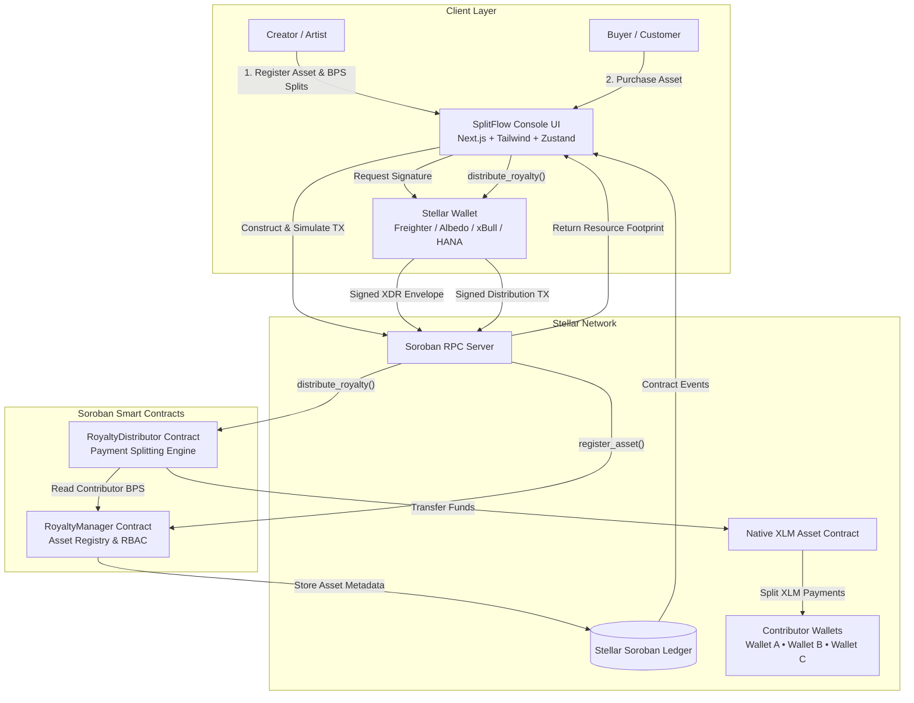
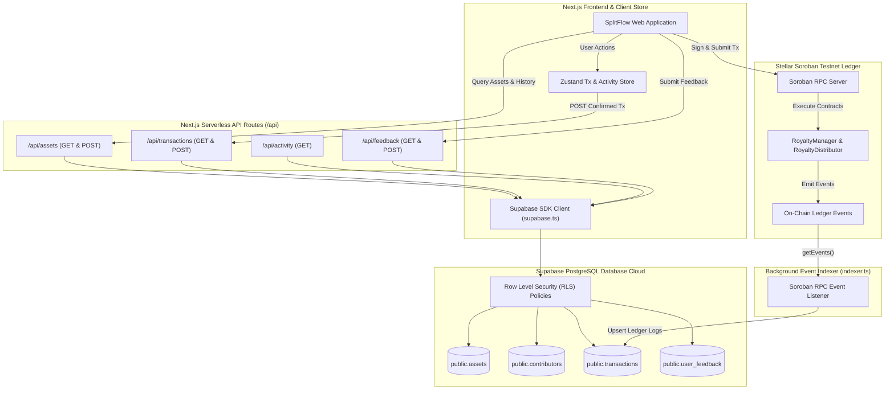

# 🏗️ SplitFlow Architecture Overview

SplitFlow is a decentralized, trustless royalty distribution platform built on the **Stellar blockchain** using **Soroban WebAssembly (WASM) smart contracts**.

---

## 🎯 Architecture Principles

1. **Decoupled Architecture**: Separates asset governance (`RoyaltyManager`) from payment execution (`RoyaltyDistributor`).
2. **Basis-Point Precision**: Stores contributor split shares in basis points ($1 \text{ bp} = 0.01\%$) with a strict $10,000\text{ bp} = 100.00\%$ validation rule.
3. **Atomic Execution**: Payment splitting occurs within a single Soroban invocation; funds are transferred directly to contributor wallets on-chain.
4. **Transparent Auditability**: Every asset registration and payment emits standard Soroban events logged permanently on the Stellar ledger.

---

## 📐 System Component Diagram

---

## 🗄️ Supabase Database & Event Indexing Architecture

---

## 🔢 Basis Points (BPS) Math Engine

Royalty shares are represented as integers ranging from $1$ to $10,000$:

$$\text{Share Percentage (\%)} = \frac{\text{Basis Points (BPS)}}{100}$$

### Split Formula
Given a total payment amount $P$ in Stroops ($1\text{ XLM} = 10^7\text{ Stroops}$) and contributor share $S_i$ in BPS:

$$\text{Payment}_i = \left\lfloor \frac{P \times S_i}{10,000} \right\rfloor$$

### Remainder Dust Prevention
To ensure zero tokens are stranded, any integer division remainder (dust) is automatically allocated to the asset owner:

$$\text{Dust} = P - \sum_{i=1}^{n} \text{Payment}_i$$

---

## 🔒 Security & Authorization Model

- **Asset Ownership**: Only the original creator address passed during `register_asset` can execute `update_asset` or `deactivate_asset`.
- **Active State Check**: `distribute_royalty` validates `is_active == true`. Inactive assets reject distribution transactions automatically.
- **Maximum Contributor Bound**: Assets are bounded to a maximum of 10 contributors per asset to enforce deterministic gas limits.
