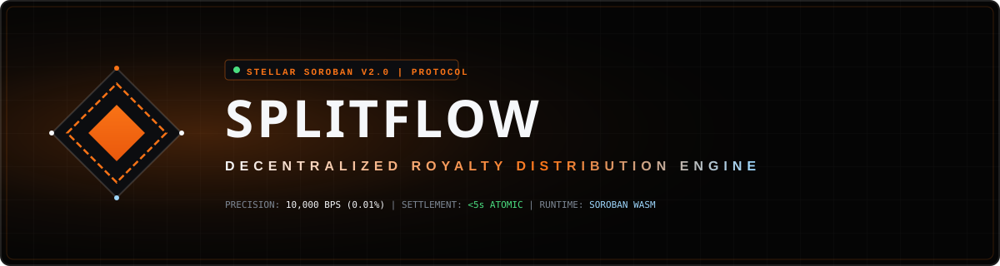
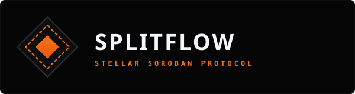
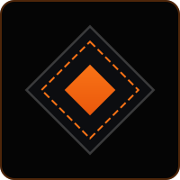

# 🎨 SplitFlow Brand Identity & Design System

> Official Brand Guidelines, Vector Logo Assets, Color Palette Tokens, and Typography Specifications for **SplitFlow — Soroban Royalty Protocol**.

---

## 💎 1. Brand Logo & Visual Assets

SplitFlow's brand identity features an architectural, high-tech geometric mark representing cryptographic split precision, atomic smart contract routing, and real-time Soroban ledger execution.

### Official Brand Logo Vectors

| Logo Variant | Description | Vector Asset Path | Preview |
|:---|:---|:---|:---:|
| **Header Banner** | Primary dark architectural header banner for GitHub README & presentation decks | [`assets/brand/splitflow_logo_banner.svg`](../assets/brand/splitflow_logo_banner.svg) |  |
| **Primary Horizontal Logo** | Full brand mark + wordmark for web navigation & headers | [`assets/brand/splitflow_logo_primary.svg`](../assets/brand/splitflow_logo_primary.svg) |  |
| **Protocol Mark / App Icon** | Standalone geometric diamond icon for favicons, app badges & social cards | [`assets/brand/splitflow_logo_mark.svg`](../assets/brand/splitflow_logo_mark.svg) |  |

---

## 🎨 2. Color Palette System

SplitFlow employs an obsidian architectural color palette inspired by modern blockchain developer tools, Soroban telemetry interfaces, and low-latency financial systems:

```
  ┌──────────────────┐  ┌──────────────────┐  ┌──────────────────┐  ┌──────────────────┐
  │  #050505         │  │  #0C0D10         │  │  #F97316         │  │  #9ED8FF         │
  │  Obsidian Core   │  │  Dark Surface    │  │  Primary Orange  │  │  Glacial Blue    │
  └──────────────────┘  └──────────────────┘  └──────────────────┘  └──────────────────┘
```

### Token Specifications

| Token Name | Hex Code | HSL / RGB | Usage & Application |
|:---|:---|:---|:---|
| **Obsidian Core** | `#050505` | `hsl(0, 0%, 2%)` | Primary application background, deep canvas fill |
| **Dark Surface** | `#0C0D10` | `hsl(220, 14%, 5%)` | Architectural panels, cards, inputs, modal backgrounds |
| **Primary Accent Orange** | `#F97316` | `hsl(24, 95%, 53%)` | Primary CTA buttons, core diamond logo, active state highlights |
| **Glacial Blue** | `#9ED8FF` | `hsl(204, 100%, 81%)` | Telemetry highlights, headline gradient accents, telemetry links |
| **Gold Ore Accent** | `#CFAE6E` | `hsl(40, 52%, 62%)` | Royalty split indicators, secondary brand accents |
| **Success Green** | `#4ade80` | `hsl(142, 69%, 58%)` | Confirmed transaction status, live feed badges |
| **Text Primary** | `#F5F7FA` | `hsl(216, 33%, 97%)` | Primary headlines, title wordmarks, high-contrast labels |
| **Text Secondary** | `#B8C0CC` | `hsl(218, 17%, 76%)` | Body subtext, descriptions, metadata labels |

---

## 🔤 3. Typography Hierarchy

SplitFlow uses two curated Google Fonts to enforce technical precision and readability:

1. **Display & Header Font — `Michroma`**
   - **Usage**: Main title banner, section headings, card titles, hero display copy (`text-hero-giant`).
   - **Characteristics**: Wide, geometric, futuristic sans-serif displaying uppercase strength.

2. **Technical & Telemetry Font — `JetBrains Mono`**
   - **Usage**: Contract addresses, BPS calculations, code snippets, transaction hashes, badges.
   - **Characteristics**: Monospaced font designed for developer reading clarity.

---

## 📦 4. Asset Download & Usage Rules

- All logo files are stored in vector SVG format under `assets/brand/` for maximum scalability without quality loss.
- Always maintain clear space around the logo mark equal to half the width of the inner orange diamond.
- Do not alter the gradient angle or substitute unapproved colors.
